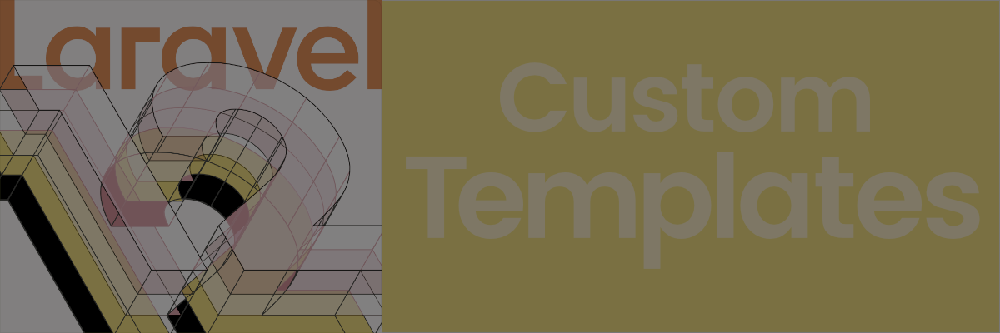

<picture>
  <source media="(prefers-color-scheme: dark)" srcset=".github/img/dark.png">
  <source media="(prefers-color-scheme: light)" srcset=".github/img/light.png">
  
</picture>

<p align="center">
<a href="https://github.com/druidweb/druid/blob/main/clover.xml"></a>
<a href="https://github.com/druidweb/druid/actions"></a>
<a href="https://packagist.org/packages/druidweb/druid"></a>
<a href="https://packagist.org/packages/druidweb/druid"></a>
<a href="https://packagist.org/packages/druidweb/druid"></a>
</p>

# Druid Starter Kit

The most comprehensive and battle-tested Laravel + Vue starter kit available. Built with modern best practices, complete testing coverage, and production-ready tooling to accelerate your development from day one. Features cutting-edge technologies like Laravel 12, Vue 3 with TypeScript, Tailwind 4, and a complete CI/CD pipeline with automated testing and deployment.

Unlike other starter kits that give you a basic setup and leave you to figure out the rest, Druid provides a complete development ecosystem. Every component is tested, every workflow is automated, and every decision has been made with scalability and maintainability in mind. From comprehensive testing with Pest and Vitest to automated semantic releases, this isn't just a starter kit, it's a complete foundation for building production applications that can grow with your business.

## Features

- 🚀 [Laravel 12](https://laravel.com) - Latest Laravel with PHP 8.3+ support
- ⚡️ [Vue 3](https://vuejs.org) with [Vite](https://vitejs.dev)
- 🧩 [Shadcn-Vue](https://www.shadcn-vue.com) - Beautiful, accessible, and responsive UI components
- 🔧 [TypeScript](https://www.typescriptlang.org) - Full type safety
- 🎨 [Tailwind 4](https://tailwindcss.com) with dark mode support
- 📱 [Inertia.js](https://inertiajs.com) - Modern single-page apps without API complexity
- 🔒 [Laravel Sanctum](https://laravel.com/docs/sanctum) - API authentication
- 🧪 [Pest PHP](https://pestphp.com) - Testing with pleasure
- ⚡️ [Vitest](https://vitest.dev) - Fast JavaScript unit testing
- 🔍 [Larastan](https://github.com/larastan/larastan) - Static analysis for Laravel
- 📝 [ESLint](https://eslint.org) + [Prettier](https://prettier.io) - Consistent code style
- 🔄 Automated releases with semantic-release
- 👷 GitHub Actions workflows for testing and deployment
- 🏗️ Pre-configured development environment
- 💯 100% code coverage with automated reporting

## Requirements

- PHP 8.3 or higher
- Composer 2+
- Node.js 18+ (preferably Bun)
- SQLite / MySQL / PostgreSQL

## Installation

First, ensure you have the Laravel installer v5.14+ installed globally:

```bash
composer global require laravel/installer
```

Then create a new Laravel application using this starter kit:

```bash
laravel new --using=druidweb/druid
```

For more information about Laravel starter kits, please refer to the [Laravel documentation](https://laravel.com/docs/12.x/starter-kits).

## Development

```bash
# Update all dependencies
bun run cb

# Start development server
bun run dev

# Build for production
bun run build

# Format code
bun run format

# Lint code
bun run lint

# Run JavaScript tests (Vitest)
bun run test:js

# Run tests
composer test

# Run tests with coverage
composer test:coverage

# Run static analysis
composer analyse
```

## Maintenance Branches

This starter kit follows semantic versioning using maintenance branches:

- `main` - Latest development version
- `N.x` - Maintenance branches for major versions (e.g., `1.x`, `2.x`)

---

## Contributing

Please see [CONTRIBUTING.md](CONTRIBUTING.md) for details.

## Security Vulnerabilities

Please review [our security policy](https://github.com/druidweb/druid/security/policy) on how to report security vulnerabilities.

## License

The MIT License (MIT). Please see [License File](LICENSE.md) for more information.
