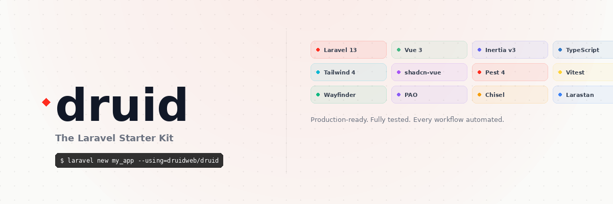

<picture>
  <source media="(prefers-color-scheme: dark)" srcset=".github/img/dark.png">
  <source media="(prefers-color-scheme: light)" srcset=".github/img/light.png">
  
</picture>

<p align="center">
<a href="https://github.com/druidweb/druid/blob/main/coverage.xml"></a>
<a href="https://github.com/druidweb/druid/actions/workflows/main.yml"></a>
<a href="https://packagist.org/packages/druidweb/druid"></a>
<a href="https://packagist.org/packages/druidweb/druid"></a>
<a href="https://packagist.org/packages/druidweb/druid"></a>
</p>

# Druid Starter Kit

The most comprehensive and battle-tested Laravel + Vue starter kit available. Built with modern best practices, complete testing coverage, and production-ready tooling to accelerate your development from day one. Features cutting-edge technologies like Laravel 13, Inertia 3, Vue 3 with TypeScript, Tailwind 4, and a complete CI/CD pipeline with automated testing and deployment.

Unlike other starter kits that give you a basic setup and leave you to figure out the rest, Druid provides a complete development ecosystem. Every component is tested, every workflow is automated, and every decision has been made with scalability and maintainability in mind. From comprehensive testing with Pest and Vitest to automated semantic releases, this isn't just a starter kit, it's a complete foundation for building production applications that can grow with your business.

> **Druid includes all Laravel Jetstream and Fortify features** - Teams, API tokens, profile management, two-factor authentication, browser sessions, password reset, email verification, and more - rebuilt from the ground up with Vue 3, TypeScript, and 100% test coverage.

## Features

### Core Stack

- 🚀 [Laravel 13](https://laravel.com) - Latest Laravel with PHP 8.5+ support
- ⚡️ [Vue 3](https://vuejs.org) with [Vite](https://vitejs.dev) and SSR support
- 🧩 [Shadcn-Vue](https://www.shadcn-vue.com) - Beautiful, accessible UI components
- 🔧 [TypeScript](https://www.typescriptlang.org) - Full type safety across the stack
- 🎨 [Tailwind 4](https://tailwindcss.com) with dark mode support
- 📱 [Inertia.js 3](https://inertiajs.com) - Modern SPAs with the new v3 adapter and resolver API

### Authentication & Security (Fortify + Jetstream Features)

- 🔐 **Two-Factor Authentication** - TOTP-based 2FA with recovery codes
- 🔑 **API Token Management** - Personal access tokens with granular permissions
- 👥 **Team Management** - Create teams, invite members, assign roles
- 📧 **Team Invitations** - Email-based invitations with signed URLs
- 🖼️ **Profile Photos** - User avatar uploads with automatic storage
- 📋 **Browser Sessions** - View and logout other active sessions
- 🗑️ **Account Deletion** - Self-service deletion with confirmation
- 📜 **Terms & Privacy Policy** - Legal document pages with agreement tracking
- 🔒 **Password Reset** - Secure email-based password recovery
- ✉️ **Email Verification** - Verified email enforcement
- 🔄 **Password Confirmation** - Sensitive action protection
- 🛡️ [Laravel Fortify](https://laravel.com/docs/fortify) - Backend authentication scaffolding
- 🔒 [Laravel Sanctum](https://laravel.com/docs/sanctum) - Cookie and token-based API auth

### Developer Experience

- 🧪 [Pest PHP](https://pestphp.com) - Elegant testing with 100% code coverage
- ⚡️ [Vitest](https://vitest.dev) - Lightning-fast JavaScript unit testing
- 🔍 [Larastan](https://github.com/larastan/larastan) - Static analysis at max level
- 🤖 [Laravel PAO](https://github.com/laravel/pao) - Agent-optimized output for Pest, PHPStan, and Paratest so AI assistants can read test results cleanly
- 📝 [ESLint](https://eslint.org) + [Prettier](https://prettier.io) - Consistent code style
- 🔄 Automated semantic releases with conventional commits
- 👷 GitHub Actions CI/CD with parallel testing
- 💯 100% code coverage with automated badge reporting

## Feature Configuration

All Jetstream-equivalent features are configurable in `config/teams.php`:

```php
'features' => [
    Features::termsAndPrivacyPolicy(),  // Terms of Service & Privacy Policy pages
    Features::profilePhotos(),           // User profile photo uploads
    Features::api(),                     // API token management
    Features::teams(['invitations' => true]),  // Teams with email invitations
    Features::accountDeletion(),         // Self-service account deletion
],
```

Simply remove any feature from the array to disable it. The UI automatically adapts to show only enabled features.

## Requirements

- PHP 8.5 or higher
- Composer 2+
- Node.js 24+ (preferably Bun)
- SQLite / MySQL / PostgreSQL

## Installation

First, ensure you have the Laravel installer v5.14+ installed globally:

```bash
composer global require laravel/installer
```

Then create a new Laravel application using this starter kit:

```bash
laravel new my_app --using=druidweb/druid
```

For more information about Laravel starter kits, please refer to the [Laravel documentation](https://laravel.com/docs/13.x/starter-kits).

## Development

```bash
# Update all dependencies
bun run cb

# Start development server
composer dev

# Build for production
bun run build

# Format code
composer lint

# Run PHP static, type, and feature tests
composer test

# Run JavaScript tests --currently 89% coverage
bun run test
```

## Maintenance Branches

This starter kit follows semantic versioning using maintenance branches:

- `main` - Latest development version
- `N.x` - Maintenance branches for major versions (e.g., `1.x`, `2.x`)

---

## Contributing

Please see [CONTRIBUTING.md](CONTRIBUTING.md) for details.

## Security Vulnerabilities

Please review [our security policy](https://github.com/druidweb/druid/security/policy) on how to report security vulnerabilities.

## License

The MIT License (MIT). Please see [License File](LICENSE.md) for more information.
